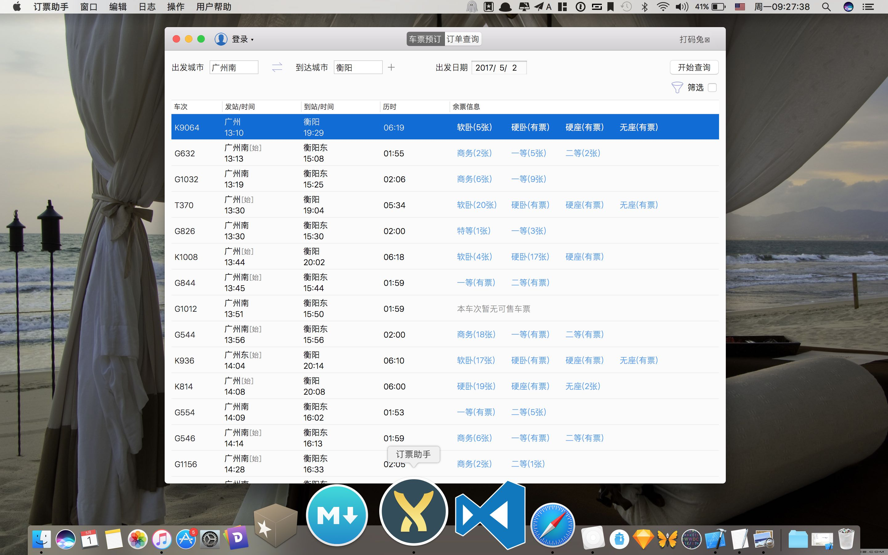

#12306ForMac
Mac版12306 订票/捡票 助手。

以前要么开Windows虚拟机，要么使用官方Web，现在可以使用12306ForMac订票助手。

注意系统要求  **OS X10.11**  以上

#下载
[Mac App Store](https://itunes.apple.com/us/app/ding-piao-zhu-shou/id1163682213?l=zh&ls=1&mt=12)

#开发
1. OS X 10.12
2. Xcode 8.0
3. Swift 3.0
4. 复制项目：$ git clone --recursive https://github.com/fancymax/12306ForMac.git 

#感谢
本项目基于 Alamofire、PromiseKit、FMDB、MASPreferences等进行开发，在此表示感谢。

